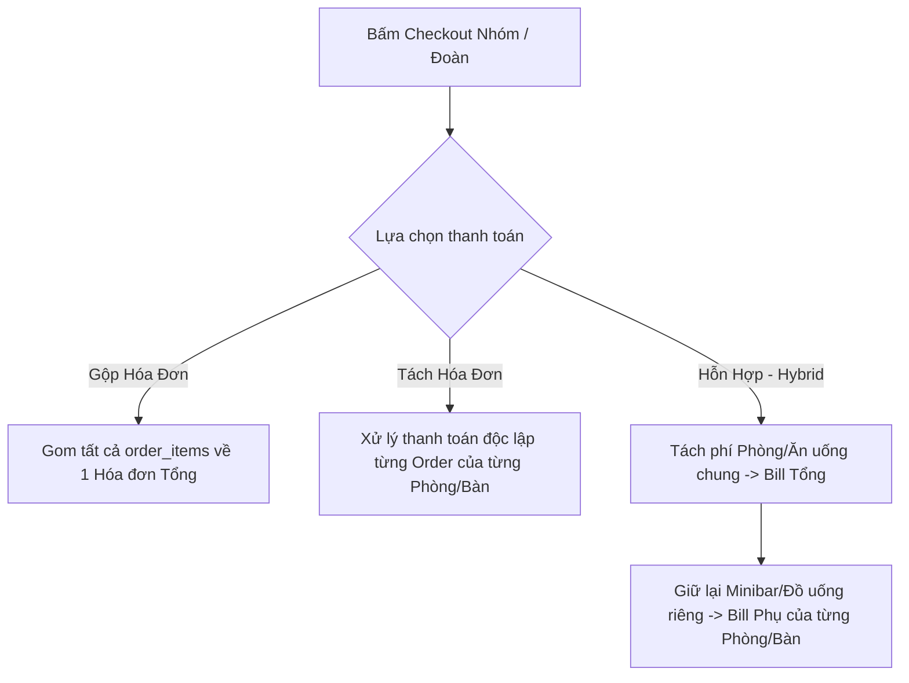

# Tài Liệu Thiết Kế: Nghiệp Vụ Đặt Nhóm (Group Booking) & Tách/Gộp Hóa Đơn (Bill Splitting/Merging)

Tài liệu này định nghĩa kiến trúc kỹ thuật và giải pháp luồng nghiệp vụ để hỗ trợ đặt phòng/đặt bàn hàng loạt, quản lý danh sách khách và cơ chế tách/gộp hóa đơn linh hoạt khi checkout. Thiết kế này áp dụng thống nhất cho cả hai ngành: **Lưu trú (Hospitality - Phòng)** và **Ẩn thực/Giải trí (FnB/Cafe - Bàn/Khu vực)**.

---

## 1. TRIẾT LÝ THIẾT KẾ CỐT LÕI: "1 RESOURCE = 1 ORDER"

Để giữ hệ thống kế toán, kho và POS không bị phá vỡ cấu trúc cơ bản, hệ thống tuân thủ nguyên lý:
*   **Resource** ở đây là một thực thể vật lý trong bảng `location_resources` (có thể có loại `room`, `table`, hoặc `court`).
*   Khi có khách sử dụng (Check-in phòng hoặc Mở bàn), hệ thống luôn khởi tạo **đúng 1 Đơn hàng POS (`orders`) ở trạng thái `in_progress`** gắn liền với Resource đó.
*   Mọi chi phí tiêu dùng (tiền giờ, minibar, đồ ăn uống) đều được phát sinh trực tiếp và lưu trữ độc lập tại `order_items` của Order này.

---

## 2. KHẢ NĂNG ÁP DỤNG CHO FNB & CAFE (ĐẶT NHIỀU BÀN / GHÉP BÀN)

Kiến trúc này hoàn toàn tương thích và áp dụng cực kỳ hiệu quả cho mảng FnB/Cafe:

### Kịch bản đặt nhiều bàn trong FnB:
*   **Tình huống:** Một công ty đặt tiệc liên hoan gồm 5 bàn (Bàn số 1, 2, 3, 4, 5). Họ yêu cầu gọi chung một Set menu cố định, nhưng nước uống thì bàn nào tự gọi thêm bàn đó tự trả, hoặc công ty chi trả toàn bộ bill.
*   **Vận hành:** 
    *   Hệ thống mở 5 Order tương ứng với 5 bàn đang có khách ngồi.
    *   Khi thanh toán (Checkout), lễ tân chọn 5 bàn này trên màn hình POS và áp dụng cơ chế xử lý hóa đơn tương tự như đặt phòng đoàn.
        *   *Gộp hóa đơn:* Gom tất cả món ăn của 5 bàn vào 1 bill thanh toán duy nhất cho Công ty.
        *   *Tách hóa đơn:* Bàn nào tự trả tiền của bàn đó.
        *   *Hybrid:* Tiền ăn Set Menu gom về Hóa đơn của Công ty; tiền đồ uống gọi thêm tự phát sinh của bàn nào thì in phiếu phụ cho bàn đó tự thanh toán.

---

## 3. THIẾT KẾ CƠ SỞ DỮ LIỆU MỞ RỘNG (DATABASE SCHEMA)

Để liên kết các thực thể độc lập lại với nhau mà không làm thay đổi cấu trúc bảng cũ, chúng ta bổ sung các trường và bảng liên kết sau:

### 3.1. Bảng Đặt phòng / Đặt bàn lẻ (`reservations`)
Bổ sung thêm cột `parent_id` (hoặc `group_booking_id`) để nhóm các phòng/bàn đặt chung lại với nhau.
```typescript
group_booking_id: varchar('group_booking_id', { length: 255 }), // NULL nếu là khách đơn lẻ
```

### 3.2. Bảng Đơn hàng POS (`orders`)
Bổ sung thêm cột `group_order_id` (hoặc `parent_order_id`) để liên kết các Order con đang chạy của cùng một đoàn/nhóm bàn.
```typescript
parent_order_id: varchar('parent_order_id', { length: 255 }), // Dùng khi gộp/tách hóa đơn lúc checkout
```

### 3.3. Bảng Danh sách khách thực tế (`reservation_guests` / `resource_occupants`)
Lưu danh sách khách lưu trú thực tế tại từng phòng (để báo cáo tạm trú) hoặc thông tin khách đại diện ngồi ở từng bàn.
```typescript
export const resource_occupants = mysqlTable('resource_occupants', {
  id: varchar('id', { length: 255 }).primaryKey(),
  tenant_id: varchar('tenant_id', { length: 255 }).notNull(),
  branch_id: varchar('branch_id', { length: 255 }).notNull(),
  order_id: varchar('order_id', { length: 255 }).notNull(), // Liên kết tới POS Order đang chạy
  resource_id: varchar('resource_id', { length: 255 }).notNull(), // ID Phòng / Bàn
  
  guest_name: varchar('guest_name', { length: 255 }).notNull(),
  guest_phone: varchar('guest_phone', { length: 50 }),
  identity_card: varchar('identity_card', { length: 100 }), // CMND/CCCD/Passport cho phòng
  nationality: varchar('nationality', { length: 100 }).default('Vietnam'),
  birthday: varchar('birthday', { length: 50 }),
  is_primary: boolean('is_primary').default(false), // Khách đại diện phòng/bàn
});
```

---

## 4. CHI TIẾT LUỒNG XỬ LÝ HÓA ĐƠN LÚC CHECKOUT (BILL ROUTING LOGIC)

Khi lễ tân bấm nút "Thanh toán đoàn / Thanh toán nhóm", hệ thống sẽ xử lý như sau trên giao diện và API:



### Chi tiết kỹ thuật của luồng Hybrid (Hỗn hợp):
1.  **Bước 1:** Lễ tân chọn danh sách các phòng/bàn cần thanh toán hỗn hợp.
2.  **Bước 2:** Giao diện hiển thị danh sách tất cả các món (items) của các phòng/bàn đó.
3.  **Bước 3 (Gợi ý tự động của hệ thống):**
    *   Hệ thống tự động lọc toàn bộ các item có loại là `room_rate` (tiền phòng) hoặc các món ăn Set Menu được đánh dấu là "chung" chuyển sang **Hóa đơn Tổng (Master Order)**.
    *   Các item còn lại (minibar, đồ uống lẻ) giữ nguyên tại **Order con** của từng phòng/bàn.
4.  **Bước 4:** Lễ tân có thể kéo thả thủ công các món phát sinh qua lại giữa Hóa đơn Tổng và Hóa đơn Phụ nếu khách có yêu cầu đặc biệt.
5.  **Bước 5:** Thực hiện thanh toán:
    *   Thanh toán Hóa đơn Tổng (ghi nhận công nợ cho Công ty lữ hành hoặc Trưởng đoàn).
    *   In bill phụ và thanh toán từng Order con ngay tại quầy cho từng khách lẻ.

---

## 5. BẢO VỆ HỆ THỐNG KHÔNG BỊ BREAK (SAFETY GUIDELINES)

*   **Không thay đổi luồng thanh toán cũ của khách lẻ:** Khách đặt 1 phòng/1 bàn thông thường sẽ đi thẳng từ Order con ra màn hình Thanh toán POS hiện tại. Màn hình Checkout Dashboard chỉ xuất hiện khi Order có chứa `parent_order_id` hoặc khi lễ tân chủ động chọn tính năng "Thanh toán nhóm".
*   **Toàn vẹn kho hàng (Inventory Auditing):** Việc chuyển dịch các sản phẩm (minibar, F&B) qua lại giữa các hóa đơn chỉ là thao tác chuyển chủ thể thanh toán (Billing Entity). Nó không làm thay đổi số lượng thực tế đã xuất kho (đã được ghi nhận khi khách tiêu dùng), bảo đảm báo cáo kho luôn chính xác.
*   **Báo cáo dòng tiền (Cashbook):** Mỗi hóa đơn thanh toán thực tế (dù là tổng hay phụ) khi kết thúc đều sinh ra phiếu thu (`cashbook`) tương ứng với hình thức thanh toán thực tế (chuyển khoản đại lý, hoặc khách lẻ trả tiền mặt). Không tạo phiếu thu ảo.
