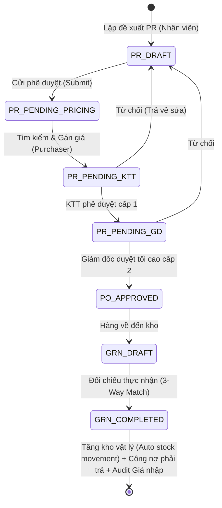

# Tài liệu Kỹ thuật: Phân hệ Mua sắm Doanh nghiệp (P2P - Procure-to-Pay) Add-on

Tài liệu này cung cấp hướng dẫn kiến trúc kỹ thuật, thiết kế cơ sở dữ liệu, luồng nghiệp vụ và cách bảo trì phân hệ **P2P (Procure-to-Pay)** nâng cao trên hệ sinh thái ONI.vn. Phân hệ này được thiết kế theo dạng **Add-on Doanh nghiệp (Plug-and-Play)**, có thể bật/tắt linh hoạt cho từng Tenant thông qua Feature Flag chuyên biệt.

---

## 1. Kiến trúc Nghiệp vụ & Triết lý Thiết kế

Phân hệ P2P kiểm soát nghiêm ngặt toàn bộ quy trình mua sắm nguyên vật liệu từ lúc đề xuất đến khi đối chiếu thực tế và hạch toán dòng tiền để chặn đứng rủi ro thất thoát:



### Triết lý "Plug-and-Play" & An toàn tuyệt đối (Non-invasive design)
*   **Bảo vệ POS offline-first & Cache engine**: Khi phiếu nhập kho đối chiếu (GRN) được duyệt hoàn tất, hệ thống không can thiệp vào logic cũ mà **tự động sinh ra bản ghi `stock_movements` chuẩn dạng `IN` và `COMPLETED`** tương thích 100% với hệ thống kho legacy. Điều này giúp các cơ chế đồng bộ POS, đồng bộ ngoại tuyến và cache của ONI hoạt động bình thường, không gây rủi ro hồi quy (zero regression risk).
*   **Decoupled hoàn toàn khỏi CRM**: Gating giao diện dựa trên Flag chuyên biệt cho Kho vận (`FEATURE_ADVANCED_P2P = 'warehouse_p2p'`), không bị ràng buộc bởi bất kỳ logic bán hàng hay phân hệ CRM nào khác.

---

## 2. Phân quyền & Chống Gian lận (Anti-Fraud Gating)

Phân hệ tích hợp các chốt chặn phân quyền RBAC nghiêm ngặt nhằm tránh việc nhân viên mua sắm tự ý bắt tay với nhà cung cấp để thay đổi thông tin thụ hưởng hoặc xóa lịch sử:
*   **Nhân viên mua sắm (`purchaser`)**: Được quyền tìm kiếm, tạo mới Nhà cung cấp (`suppliers.create`) để phục vụ sourcing, được quyền gán giá mua dự kiến vào PR.
*   **Khóa cứng Quyền Sửa/Xóa Nhà cung cấp**: Nhân viên mua sắm bị **khóa tuyệt đối** quyền Sửa (`suppliers.edit`) và Xóa (`suppliers.delete`). Chỉ tài khoản thuộc nhóm **Kế toán trưởng (`chief_accountant`)**, **Ban giám đốc (`admin`)** hoặc **Chủ sở hữu (`owner`)** mới có quyền chỉnh sửa tài khoản thanh toán hoặc xóa NCC trên hệ thống.
*   **Duyệt hạn mức điện tử**:
    *   Thao tác gán giá: Yêu cầu vai trò `purchaser`, `purchasing.manage` hoặc `admin`.
    *   Duyệt cấp 1: Chỉ dành cho `chief_accountant`, `admin` hoặc `owner`.
    *   Duyệt tối cao cấp 2: Chỉ dành cho `admin` hoặc `owner`.
    *   Duyệt GRN hoàn tất nhập kho: Yêu cầu vai trò `warehouse.manage`, `chief_accountant`, `admin`, hoặc `owner`.

---

## 3. Cấu trúc Cơ sở Dữ liệu (Database Schema Layer)

Cấu trúc gồm 7 bảng độc lập trong hệ thống để quản lý phân hệ mua sắm P2P:

### 3.1. Bảng `purchase_requisitions` (Đề xuất mua sắm PR)
Lưu giữ thông tin đầu phiếu đề xuất mua vật tư.
*   `id` (`varchar(255)` - PK sequential prefix: `PR-`)
*   `requisition_no` (`varchar(255)`)
*   `status` (`varchar(50)`): Trạng thái (`DRAFT` \| `PENDING_PRICING` \| `PENDING_KTT` \| `PENDING_GD` \| `APPROVED` \| `CONVERTED_TO_PO` \| `REJECTED`)
*   `created_by` (`varchar(255)`): ID người tạo
*   `estimated_total` (`varchar(50)`): Tổng tiền dự kiến (lưu chuỗi varchar theo quy chuẩn chung của ONI)
*   `note` (`text`): Lý do đề xuất
*   `branch_id` (`varchar(255)` - FK)
*   `tenant_id` (`varchar(255)` - FK)

### 3.2. Bảng `purchase_requisition_items` (Chi tiết đề xuất PR)
Lưu chi tiết các mặt hàng cần mua trong PR.
*   `id` (`varchar(255)` - PK prefix: `PRI-`)
*   `requisition_id` (`varchar(255)` - FK)
*   `product_id` (`varchar(255)` - FK)
*   `product_name` (`varchar(255)`)
*   `qty` (`varchar(50)`): Số lượng yêu cầu
*   `estimated_unit_price` (`varchar(50)`): Đơn giá dự kiến sau đàm phán
*   `line_total` (`varchar(50)`): Thành tiền dự toán

### 3.3. Bảng `purchase_orders` (Đơn đặt hàng PO)
Lưu hợp đồng đặt mua chính thức gửi đối tác.
*   `id` (`varchar(255)` - PK prefix: `PO-`)
*   `purchase_order_no` (`varchar(255)`)
*   `requisition_id` (`varchar(255)` - FK)
*   `supplier_id` (`varchar(255)` - FK)
*   `supplier_name` (`varchar(255)`)
*   `purchaser_id` (`varchar(255)`): ID người lập PO
*   `total_amount` (`varchar(50)`): Tổng giá trị hợp đồng đặt mua
*   `status` (`varchar(50)`): Trạng thái giao hàng (`APPROVED` \| `RECEIVED` \| `CANCELLED`)
*   `branch_id` (`varchar(255)` - FK)

### 3.4. Bảng `purchase_order_items` (Chi tiết đơn PO)
Lưu chi tiết các mặt hàng trong đơn hàng PO.
*   `id` (`varchar(255)` - PK prefix: `POI-`)
*   `purchase_order_id` (`varchar(255)` - FK)
*   `product_id` (`varchar(255)` - FK)
*   `product_name` (`varchar(255)`)
*   `qty` (`varchar(50)`): Số lượng đặt hàng
*   `actual_unit_price` (`varchar(50)`): Đơn giá ký hợp đồng
*   `line_total` (`varchar(50)`): Thành tiền mặt hàng

### 3.5. Bảng `goods_receipt_notes` (Phiếu nhập kho đối chiếu GRN)
Lưu thông tin đối chiếu thực tế khi hàng về kho.
*   `id` (`varchar(255)` - PK prefix: `GRN-`)
*   `grn_no` (`varchar(255)`)
*   `purchase_order_id` (`varchar(255)` - FK)
*   `received_by` (`varchar(255)`): Nhân viên thủ kho nhận hàng
*   `status` (`varchar(50)`): Trạng thái đối chiếu (`DRAFT` \| `COMPLETED`)
*   `branch_id` (`varchar(255)` - FK)

### 3.6. Bảng `goods_receipt_note_items` (Chi tiết đối chiếu GRN)
Lưu thông tin đếm hàng thực nhận và so sánh lệch 3-Way Match.
*   `id` (`varchar(255)` - PK prefix: `GRI-`)
*   `grn_id` (`varchar(255)` - FK)
*   `product_id` (`varchar(255)` - FK)
*   `product_name` (`varchar(255)`)
*   `qty_ordered` (`varchar(50)`): Số lượng đặt trên PO
*   `qty_received` (`varchar(50)`): Số lượng thực nhận thủ kho kiểm đếm
*   `unit_cost` (`varchar(50)`): Đơn giá nhập hàng thực tế
*   `line_total` (`varchar(50)`): Thành tiền thực tế

### 3.7. Bảng `product_purchase_history` (Lịch sử giá nhập)
Lưu vết audit giá của từng sản phẩm để hỗ trợ phân tích và so sánh năng lực của các nhà cung cấp.
*   `id` (`varchar(255)` - PK prefix: `PPH-`)
*   `product_id` (`varchar(255)` - FK)
*   `supplier_id` (`varchar(255)` - FK)
*   `supplier_name` (`varchar(255)`)
*   `unit_price` (`varchar(50)`): Đơn giá mua hàng thực tế
*   `purchased_at` (`varchar(50)`): Ngày ghi nhận

---

## 4. Công cụ hạch toán & Tính toán tự động (Core Engine)

Toàn bộ logic chuyển đổi trạng thái và hạch toán tự động được xây dựng tập trung tại lớp `P2PEngine` (`packages/core/src/p2p/p2pEngine.ts`).

### 4.1. Công thức Giá trung bình di động (Moving Average Cost)
Khi phiếu đối chiếu nhập kho (GRN) được kế toán xác nhận duyệt `COMPLETED`, hệ thống tự động tính toán lại giá vốn trung bình di động của sản phẩm tại chi nhánh đó để phục vụ tính toán chỉ số giá vốn hàng bán BOM/COGS chuẩn xác:

$$\text{Giá vốn mới} = \frac{(Q_{\text{hiện tại}} \times C_{\text{hiện tại}}) + (Q_{\text{thực nhận}} \times C_{\text{nhập thực tế}})}{Q_{\text{hiện tại}} + Q_{\text{thực nhận}}}$$

*   **Q_hiện tại**: Số lượng tồn kho chi nhánh trước khi nhập.
*   **C_hiện tại**: Giá vốn chi nhánh trước khi nhập.
*   **Q_thực nhận**: Lượng hàng thực tế đếm được thủ kho ghi nhận trên GRN (`qty_received`).
*   **C_nhập thực tế**: Giá mua thực tế ghi nhận trên GRN (`unit_cost`).

Sau khi tính toán xong giá vốn chi nhánh mới, hệ thống tự động cập nhật bản ghi tại bảng `inventory` và **đồng bộ ngược về bảng `products` (Catalog tổng)** để cập nhật lại `cost_price` catalog, đảm bảo báo cáo BOM chính xác.

### 4.2. Hạch toán Công nợ Phải trả Lục bộ (Internal Debt Control)
Ngay khi GRN được hoàn tất, hệ thống tự động tính tổng tiền thực tế nhập kho:

$$\text{Tổng tiền thực tế} = \sum (Q_{\text{thực nhận}} \times C_{\text{nhập thực tế}})$$

Khoản tiền này sẽ được cộng trực tiếp vào sổ nợ phải trả của nhà cung cấp liên quan:

$$\text{Nợ mới} = \text{Nợ cũ} + \text{Tổng tiền thực tế}$$

Cập nhật trực tiếp vào cột `suppliers.debt_amount` trong cơ sở dữ liệu nội bộ của ONI. Điều này giúp chủ cửa hàng đối chiếu dòng tiền phải trả trực tiếp trên ONI trước khi kết xuất (sync) dữ liệu sang các nền tảng kế toán bên thứ 3 (MISA/SAP).

---

## 5. Cổng API điều hướng (Multiplexer API Gateway)

Toàn bộ các tác vụ P2P Frontend đều gọi qua một Endpoint duy nhất để tối ưu bảo mật và phân quyền: `/api/shops/[shopId]/p2p` (`apps/web/app/api/shops/[shopId]/p2p/route.ts`).

Cổng API này sử dụng cơ chế multiplexer dựa trên tham số `body.action`:
*   `CREATE`: Tạo một bản ghi mới (Ví dụ: tạo PR, GRN). Thực hiện chốt chặn kiểm tra quyền `suppliers.create` nếu thực thể tạo là `suppliers`.
*   `UPDATE`: Chỉnh sửa bản ghi. Thực hiện chốt chặn kiểm tra quyền quản lý (`chief_accountant`/`admin`/`owner`) đối với thực thể `suppliers`.
*   `DELETE`: Xóa/vô hiệu hóa bản ghi. Khóa cứng đối với vai trò purchaser.
*   `TRANSITION_PR`: Điều phối chuyển đổi trạng thái PR, kiểm tra quyền duyệt cấp 1 (Kế toán trưởng) và cấp 2 (Giám đốc).
*   `CREATE_PO_FROM_PR`: Chuyển đề xuất được phê duyệt thành PO chính thức.
*   `APPROVE_GRN`: Phê duyệt hoàn tất nhập kho, tính toán giá vốn và công nợ.

---

## 6. Hướng dẫn Vận hành & Kiểm thử cho Developer

### 6.1. Áp dụng Cập nhật Schema vào Database
Khi thay đổi hoặc triển khai mới schema, hãy chạy lệnh sau từ thư mục gốc của dự án để đẩy schema Drizzle lên PostgreSQL:
```bash
pnpm db:push:pg
```

### 6.2. Áp dụng Roles & Permissions lên Supabase (Local/Production)
Phân hệ P2P yêu cầu gán các nhóm quyền hạn RBAC mới cho các vai trò mặc định (hoặc tùy biến) trong hệ thống. Để đăng ký các permission key và seed các role mặc định (`purchaser`, `chief_accountant`) vào Supabase, hãy chạy Supabase migration SQL đã được lưu tại:
[20260525000000_p2p_permissions.sql](file:///Users/fern/Coding/ERP/oni-saas-starter/supabase/migrations/20260525000000_p2p_permissions.sql)

*   **Chạy cục bộ (Local Development)**:
    ```bash
    supabase db reset
    ```
    hoặc chạy trực tiếp nội dung file SQL thông qua Supabase Dashboard (SQL Editor) hoặc CLI.

### 6.3. Chạy Thử nghiệm Quy trình Liên hoàn (E2E Test)
Để kiểm tra tính toàn vẹn của logic nghiệp vụ P2P, tính toán giá vốn trung bình di động, ghi nhận công nợ và sinh stock movement legacy, hãy chạy script kiểm thử tự động sau:
```bash
npx tsx packages/core/src/p2p/p2p_e2e_test.ts
```

Script này mô phỏng toàn bộ vòng đời của một quy trình mua sắm từ lúc lập đề xuất hạt cà phê đến khi phê duyệt, đặt PO, đối chiếu số lượng nhận hàng tại GRN, hạch toán tăng kho và so sánh các kết quả đầu ra thực tế so với kỳ vọng số học. Đảm bảo toàn bộ các chỉ tiêu đối chiếu đều báo `✅ ĐẠT (MATCH)` trước khi đẩy mã nguồn lên nhánh chính.
