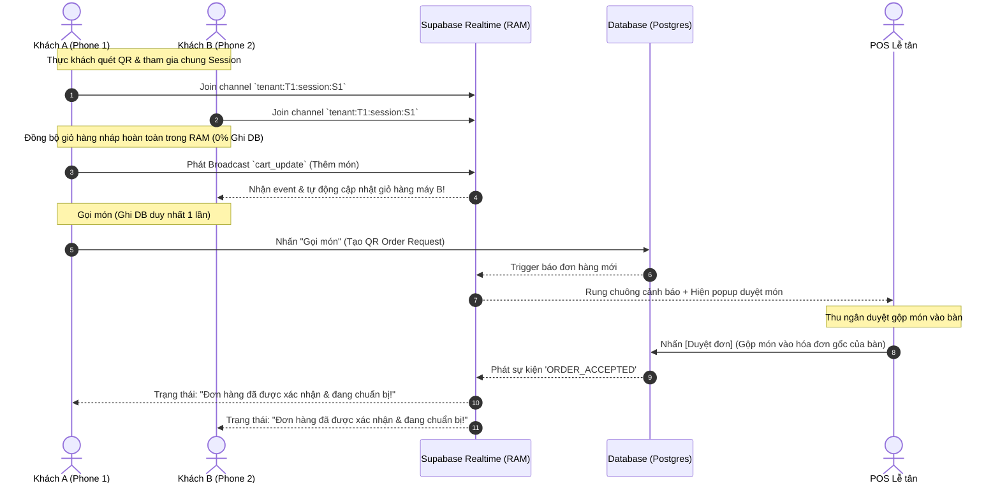

# Hướng dẫn Kỹ thuật: Hệ thống Gọi Món Tại Bàn/Phòng Qua QR (QR Table Ordering)

Hệ thống **Gọi Món tại Bàn/Phòng qua QR** trong **Oni SaaS Starter** là một phân hệ (module) độc lập, thiết kế theo kiến trúc plug-and-play, cho phép các nhà hàng, quán cafe (F&B) cung cấp trải nghiệm tự phục vụ cao cấp thông qua điện thoại của thực khách và đồng bộ hóa tức thời với màn hình POS của nhân viên thu ngân/lễ tân.

---

## 1. Kiến Trúc Real-Time & Đồng Bộ Giỏ Hàng (RAM-based Collaborative Cart)

Để hệ thống hoạt động ổn định ở quy mô hàng chục vạn kết nối đồng thời mà không làm quá tải cơ sở dữ liệu PostgreSQL chính, hệ thống sử dụng kiến trúc **Zero-DB-Write Cart Drafting** dựa trên **Supabase Realtime (Broadcast & Presence)**:

### Luồng Hoạt Động Giỏ Hàng Cộng Tác:
1. **Khai báo Trạng thái (Supabase Presence)**: 
   Khi thực khách quét mã QR, họ sẽ tham gia vào kênh (channel) Supabase Realtime dạng: `tenant:[tenantId]:session:[sessionId]`. Mỗi client tự động đăng ký sự diện diện của mình (`Presence`) với một định danh ẩn danh (`guestId`) và biệt danh. POS và các máy khác nhận tín hiệu cập nhật danh sách bạn bè online tại bàn ăn.
2. **Đồng bộ Giỏ hàng (RAM-based Broadcast)**: 
   Mỗi khi Khách A thêm, bớt hoặc chỉnh sửa số lượng hay ghi chú của một món ăn, client của Khách A sẽ phát một tín hiệu **Broadcast** chứa sự kiện `cart_update` tới kênh của bàn. Tất cả các client của Khách B, Khách C nhận được tin này trong RAM và cập nhật lại giỏ hàng hiển thị trên giao diện của mình. **Không có thao tác ghi Database nào xảy ra ở bước này.**
3. **Đón Khách Vào Sau (Late-Joiner Sync)**: 
   Khi Khách C quét mã tham gia bàn muộn hơn Khách A và B, máy của Khách C sẽ phát một tín hiệu broadcast `cart_sync_request`. Máy Khách A hoặc Khách B đang online sẽ tự động phản hồi bằng một tin nhắn `cart_sync_response` chứa toàn bộ giỏ hàng nháp hiện tại để đồng bộ tức thì cho Khách C.
4. **Ghi Database khi Gọi món**: 
   Chỉ khi thực khách bấm **"Gọi món" (Submit Order)**, giỏ hàng nháp mới được đóng gói và gửi qua một API POST duy nhất để lưu vào bảng `qr_order_requests` chờ POS lễ tân duyệt.



---

## 2. Giao Thức Bảo Mật & Phiên Động (Anti-Prank Session Protocol)

Nhằm ngăn chặn hành vi phá hoại (lưu mã QR cũ mang về nhà để gọi món trêu đùa, gọi từ xa ngoài nhà hàng), Oni áp dụng giải pháp **Phiên động (Dynamic Session Protocol)** được kiểm soát trực tiếp từ POS:

1. **Mã QR Cố định & Phiên Động**: 
   Mã QR dán trên bàn là URL cố định có dạng: `https://[shop-domain]/qr-order/[shop_slug]/[table_id]`. Tuy nhiên, khi quét mã, khách hàng chỉ có thể tương tác nếu có một phiên gọi món đang mở (`active`) gắn với bàn đó.
2. **Luồng Duyệt Mở Bàn**:
   - Khi bàn đang trống (**Available**): Khách quét QR sẽ thấy màn hình chào mừng và nút **"Yêu cầu mở bàn"**. Bấm nút sẽ gửi yêu cầu duyệt tới POS. Lễ tân chấp thuận sẽ sinh một `session_token` ngẫu nhiên mới, đổi trạng thái bàn sang bận (**Occupied**), kích hoạt phiên gọi món hoạt động (`active`).
   - Khi bàn đang bận (**Occupied**): Phiên gọi món đã hoạt động. Bất kỳ khách nào tiếp theo quét QR của bàn này sẽ được tự động liên kết trực tiếp vào phiên đang mở và giỏ hàng chung mà không cần yêu cầu mở bàn lại.
3. **Tự động đóng phiên (Auto-Cleanup)**:
   - Hệ thống áp dụng 2 cơ chế: **Tự động quét dọn bằng Cron Job** (pg_cron chạy định kỳ mỗi 10 phút, tự động chuyển các phiên hoạt động quá 4 giờ sang `completed`) và **Lazy Cleanup** (tự động dọn dẹp các session quá hạn khi có lượt quét QR mới).
   - Ngay khi thu ngân bấm **Thanh toán & Đóng phiên** trên POS, `session_token` của bàn đó lập tức chuyển sang trạng thái đóng (`completed`). Mọi cố gắng thao tác trên token cũ sẽ bị từ chối với thông báo: *"Phiên gọi món đã kết thúc."*

---

## 3. Cấu Trúc Cơ Sở Dữ Liệu (Database Schemas)

Hệ thống được định nghĩa song song trên PostgreSQL (Drizzle ORM) tại `packages/adapters/src/schema_pg.ts` nhằm đảm bảo tính đồng bộ (parity):

### Bảng 1: `qr_ordering_sessions` (Danh sách phiên gọi món)
Lưu trữ thông tin phiên, liên kết vị trí bàn ăn với mã token hoạt động.
```typescript
export const qr_ordering_sessions = pgTable('qr_ordering_sessions', {
  id: varchar('id', { length: 255 }).primaryKey(), // UUID sinh tự động
  tenant_id: varchar('tenant_id', { length: 255 }).notNull(),
  branch_id: varchar('branch_id', { length: 255 }).notNull(),
  resource_id: varchar('resource_id', { length: 255 }).notNull(), // Khóa ngoại tới location_resources
  session_token: varchar('session_token', { length: 255 }).notNull(), // Token xoay vòng bảo mật
  status: varchar('status', { length: 50 }).default('pending'), // pending | active | completed
  active: boolean('active').default(true),
  created_at: timestamp('created_at').defaultNow(),
  updated_at: timestamp('updated_at').defaultNow(),
});
```

### Bảng 2: `qr_order_requests` (Yêu cầu gọi món chờ POS duyệt)
Lưu giữ danh sách món ăn thực khách bấm gửi lên quầy, lưu trữ cấu trúc JSONB hỗ trợ variants, toppings (modifiers).
```typescript
export const qr_order_requests = pgTable('qr_order_requests', {
  id: varchar('id', { length: 255 }).primaryKey(),
  tenant_id: varchar('tenant_id', { length: 255 }).notNull(),
  branch_id: varchar('branch_id', { length: 255 }).notNull(),
  session_id: varchar('session_id', { length: 255 }).notNull(), // Khóa ngoại tới qr_ordering_sessions
  resource_id: varchar('resource_id', { length: 255 }).notNull(),
  items: jsonb('items').notNull(), // Mảng chứa các món cần gọi [{product_id, qty, modifiers...}]
  status: varchar('status', { length: 50 }).default('pending'), // pending | accepted | rejected
  reject_reason: text('reject_reason'),
  created_at: timestamp('created_at').defaultNow(),
  updated_at: timestamp('updated_at').defaultNow(),
});
```

---

## 4. Tích Hợp Giao Diện POS (Notification & Sound Alert Engine)

Hệ thống POS nhận tin nhắn real-time thông qua Supabase Realtime Postgres Changes Listener trên cả hai bảng `qr_order_requests` và `qr_ordering_sessions`:

### Bộ Tổng Hợp Âm Thanh Hợp Âm Cao Cấp (Web Audio API):
Để tránh lỗi 404 hoặc loát chậm của các file âm thanh `.mp3` tĩnh, Oni sử dụng **Web Audio API** tích hợp sẵn trong trình duyệt để tự động tổng hợp hợp âm **Ding-Dong** ấm áp, sang trọng:
* **Hợp âm Ding**: Phát tần số 880Hz (nốt A5) kèm harmonic triangle wave (1320Hz) với decay mượt mà.
* **Hợp âm Dong**: Phát tần số 659.25Hz (nốt E5) trễ sau Ding 0.28 giây để tạo tiếng chuông kép.
* Cung cấp tùy chọn **Mute/Unmute** độc lập lưu tại `localStorage` (`pos_qr_mute_sound`).

### Giao Diện Bảng Điều Khiển Duyệt Trùng Lắp (Dine-in tab & Cashier):
* **Tab Yêu cầu Mở bàn (Table Sessions)**: Quản lý các yêu cầu quét QR từ bàn trống cần cấp phép mở bàn. Duyệt sẽ chuyển trạng thái bàn sang occupied và sinh phiên động.
* **Tab Yêu cầu Gọi món (Order Requests)**: Quản lý danh sách các món ăn chờ quầy duyệt gộp.
* **Thuật toán Gộp món (Order Merge Algorithm)**:
  * Nếu bàn ăn đã có hóa đơn đang chạy (`in_progress`): Duyệt món từ QR sẽ tự động so khớp `product_id`, `variant_label`, và `modifiers` (so sánh sâu JSON). Nếu khớp, cộng dồn số lượng `qty` và tính lại tiền. Nếu chưa có, chèn một dòng `order-item` mới vào hóa đơn hiện hữu.
  * Nếu bàn ăn trống: Tự động khởi tạo hóa đơn Dine-in mới, chuyển trạng thái bàn sang occupied và tạo danh sách món tương ứng.

---

## 5. Trình Tạo & In Mã QR Hàng Loạt (QR Printer Engine)

Cung cấp công cụ cho Admin in mã QR để dán tại bàn ăn với 2 mẫu thiết kế tối ưu thông qua CSS `@media print`:
1. **Mẫu Thẻ Để Bàn (Color Gradient Card)**: Thiết kế rực rỡ, gradient cam-amber thương hiệu sang trọng, có bo góc tinh tế thích hợp in standee ép plastic để bàn.
2. **Mẫu In Nhiệt K80/K58 (Thermal Thermal Paper)**: Tối giản trắng đen tương phản cực cao, căn lề chuẩn 80mm không tràn lề để máy in hóa đơn mini in nhiệt trực tiếp và dán bàn ăn.

---

## 6. Giao Diện Thực Khách Cao Cấp (`QRClientPage.tsx`)

Trang gọi món phía khách hàng được thiết kế Mobile-first, sang trọng, tương thích hoàn toàn Next.js Turbopack và hỗ trợ các tính năng độc đáo:

### 1. Cơ Chế Bật/Tắt Danh Sách Bạn Bè Trực Quan (Click Dropdown Toggle)
* **Semantic HTML**: Chuyển đổi component xem số lượng người sang thẻ `<button>` chuẩn, tối ưu hóa khả năng truy cập.
* **State-driven**: Kiểm soát đóng mở danh sách bạn bè online bằng biến React state `showActiveGuests`.
* **Click-Outside Detection**: Khi mở dropdown, một overlay trong suốt (`bg-transparent fixed inset-0 z-40`) sẽ được chèn phía dưới dropdown để bắt các sự kiện click bên ngoài, tự động đóng dropdown tức thì khi chạm ra ngoài mà không phát sinh lỗi hay giật gián đoạn.
* **Animation**: Sử dụng hiệu ứng `animate-scale-in` và transition mượt mà để mở ra trải nghiệm người dùng cực kỳ premium.

### 2. Nút "Sử dụng nickname ngẫu nhiên" Tạo Sự Vui Vẻ
* Trong Modal Đổi biệt danh (`isEditingName`), bổ sung nút bấm dashed `🎲 Sử dụng nickname ngẫu nhiên` với màu sắc cam/amber động đồng bộ theo Theme (Sáng/Tối) và hiệu ứng nhấn mượt `active:scale-95`.
* Khi thực khách đang ngồi chờ nhân viên quầy duyệt bàn, họ có thể nhấn nút này liên tục để thay đổi nickname thành hàng chục cái tên dễ thương (ví dụ: *Gấu Trúc Tinh Nghịch*, *Thỏ Ngọc Nhanh Nhẹn*, *Cánh Cụt Ngộ Nghĩnh*...) giúp xua tan cảm giác nhàm chán khi ngồi đợi.

### 3. Dual Themes & Thuật Ngữ Trung Lập
* **Hỗ trợ Giao diện Sáng/Tối**: Định nghĩa bộ token màu sắc động `themeClasses` linh hoạt, lưu lựa chọn qua `localStorage` (khóa `oni_qr_theme`).
* **Branded Fallback Image**: Sử dụng logo Oni thương hiệu chính hãng (`/logo.png`) bo góc tròn cho các sản phẩm không có ảnh thực đơn để tăng độ nhận diện.
* **Thuật ngữ trung lập**: Thay thế toàn bộ các thuật ngữ bếp cổ điển thành các thuật ngữ phù hợp cho cả nhà hàng lẫn quán cafe (ví dụ: *"Bếp đang làm"* chuyển thành *"Đang chuẩn bị"*, *"Ghi chú cho bếp"* đổi thành *"Yêu cầu đặc biệt"*).

---

## 7. Phân Gói Dịch Vụ Linh Hoạt (Feature Limit Gate)

Phân hệ gọi món qua QR được kiểm soát 2 lớp để hỗ trợ bật/tắt theo gói Pro/Enterprise hoặc bán lẻ dạng Add-on:
* **Lớp 1: Subscription Metadata**: Kiểm tra key `"qr_table_ordering": true` trong plans metadata.
* **Lớp 2: Feature Flags (Add-on Gate)**: Bản ghi tại bảng `feature_flags` ưu tiên bật riêng lẻ cho các cửa hàng dùng gói Mini mua lẻ tính năng.

---

## 8. Hướng Dẫn Kiểm Thử & Xác Minh (Verification Checklist)

Khi phát triển thêm hoặc triển khai cài đặt, luôn luôn kiểm tra theo checklist sau:

1. **Production Build Compilation**:
   ```bash
   pnpm build
   ```
   Đảm bảo Next.js compiler và TypeScript type-check thành công 100% không dính bất kỳ lỗi biên dịch nào.
2. **Duyệt Phiên Hoạt Động (Dine-in POS)**:
   * Quét mã bàn trống $\rightarrow$ POS nhận thông báo âm thanh Chime kép $\rightarrow$ Click Duyệt $\rightarrow$ Bàn chuyển sang bận và client của khách tự động chuyển vào trang gọi món.
3. **Đồng bộ Collaborative Cart**:
   * Mở 2 điện thoại cùng quét 1 bàn $\rightarrow$ Máy 1 thêm món $\rightarrow$ Máy 2 lập tức hiển thị món trong giỏ hàng trong RAM (0% SQL queries).
4. **Kiểm tra Dropdown Số người**:
   * Nhấp/chạm vào biểu tượng Số người $\rightarrow$ Hiện danh sách bạn bè online. Click/chạm ra ngoài màn hình $\rightarrow$ Dropdown đóng ngay lập tức. Đảm bảo không dính trạng thái hover giả lập trên di động.
5. **Sinh biệt danh**:
   * Click Đổi biệt danh $\rightarrow$ Click `Sử dụng nickname ngẫu nhiên` $\rightarrow$ Tên thay đổi liên tục và áp dụng chuẩn xác khi bấm Cập nhật.
