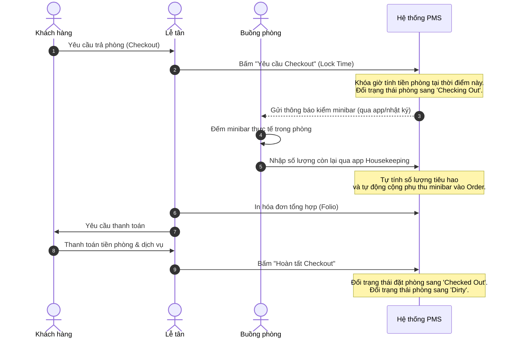
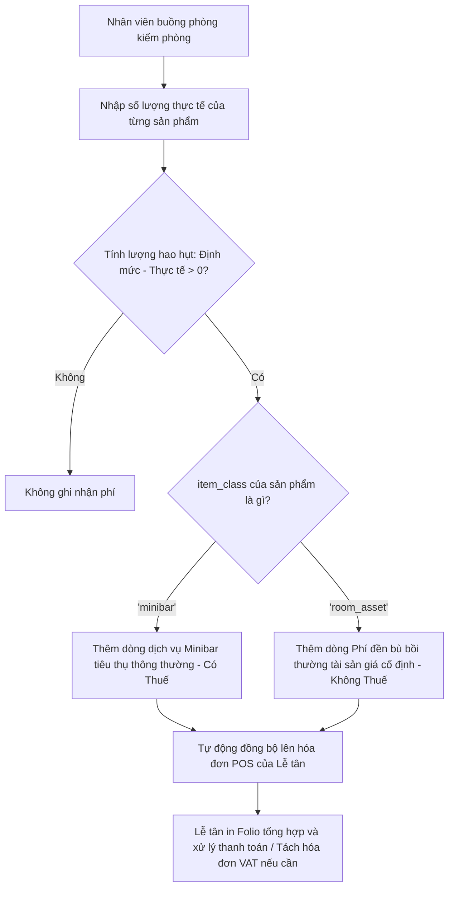

# Đặc tả Nghiệp vụ: Tối ưu hóa Luồng Checkout và Buồng phòng (SIMPLE vs Enterprise)

Tài liệu này đặc tả luồng nghiệp vụ cải tiến cho quá trình Checkout và Dọn dẹp phòng (Housekeeping), bảo đảm tính linh hoạt cao giữa hai phân khúc: **Khách sạn nhỏ / Nhà nghỉ gia đình (SIMPLE)** và **Khách sạn lớn / Chuỗi khách sạn chuyên nghiệp (Enterprise)**.

---

## 1. Thiết kế Linh Hoạt: Cấu hình Vận hành (Workflow Modes)

Để hệ thống đáp ứng cả khách sạn nhỏ (lễ tân kiêm buồng phòng) và khách sạn lớn (phân vai rõ ràng), chúng ta giới thiệu cấu hình **"Chế độ vận hành buồng phòng" (Housekeeping Workflow Mode)** trong Cấu hình chi nhánh (`shop_settings`):

```typescript
// Cấu hình bổ sung trong shop_settings
export type HousekeepingWorkflowMode = 'SIMPLE' | 'ENTERPRISE';
```

### 1.1. Chế độ SIMPLE (Tinh gọn / Gia đình vận hành)
*   **Đặc điểm:** Không phân chia bộ phận chuyên biệt. Lễ tân kiêm nhiệm dọn phòng hoặc gia đình tự vận hành.
*   **Luồng xử lý:**
    *   Lễ tân có toàn quyền đổi trạng thái dọn dẹp của phòng nghỉ trực tiếp từ màn hình Sơ đồ Gantt POS (Timeline).
    *   Bỏ qua bước nghiệm thu chất lượng phòng (**Inspected**). Phòng dọn xong báo **Clean** là có thể xếp ngay khách mới vào ở.
    *   Cung cấp tùy chọn "Checkout nhanh & Sạch ngay" cho các nhà nghỉ/khách sạn nhỏ dọn phòng lập tức khi khách ra.

### 1.2. Chế độ ENTERPRISE (Tiêu chuẩn / Chuỗi lớn chuyên nghiệp)
*   **Đặc điểm:** Phân quyền nghiêm ngặt theo vai trò (Lễ tân vs Buồng phòng vs Giám sát).
*   **Luồng xử lý:**
    *   Lễ tân **bị chặn quyền** tự ý chuyển phòng sang trạng thái **Clean** hoặc **Inspected** trên timeline POS.
    *   Sau khi Checkout thành công, phòng bắt buộc chuyển sang **Dirty** (Chưa dọn).
    *   Phòng buồng phải cập nhật trạng thái dọn dẹp theo chu kỳ: `Dirty` (Chưa dọn) $\rightarrow$ `Cleaning` (Đang dọn) $\rightarrow$ `Clean` (Đã dọn).
    *   Giám sát buồng phòng (Supervisor) kiểm tra đạt chất lượng mới chuyển phòng sang **Inspected** (Đã kiểm duyệt). Chỉ phòng `Inspected` mới được phép xếp phòng nhận khách mới.

---

## 2. Luồng Nghiệp Vụ Checkout cải tiến (Freeze/Lock Checkout Time)

Giải quyết vấn đề lệch giờ tính phòng do nhân viên đi kiểm minibar chậm trễ.

### 2.1. Lưu đồ luồng Checkout (Giai đoạn chuyển tiếp)



### 2.2. Chi tiết thực thi kỹ thuật luồng Checkout:
1.  **Bước 1: Khóa giờ tính tiền (Request Checkout)**
    *   Lễ tân bấm nút **"Khóa giờ checkout"** trên Timeline hoặc SlideOver của phòng.
    *   Hệ thống ghi nhận thời điểm khóa giờ vào trường `actual_checkout_requested_at` trong đặt phòng.
    *   **Billing Engine** dừng tính tiền phòng dựa trên mốc thời gian này.
    *   Trạng thái phòng chuyển sang **`checking_out`** (Chỉ báo nhấp nháy màu vàng nhạt trên sơ đồ Gantt).
2.  **Bước 2: Đối soát Minibar & Hư hại**
    *   Nhân viên buồng phòng vào kiểm tra phòng. Tiêu hao minibar được báo về qua app buồng phòng, tự động nạp thẳng vào đơn POS đang mở của phòng đó.
3.  **Bước 3: Thanh toán & Bàn giao**
    *   Lễ tân nhận tiền, thanh toán đơn hàng.
    *   Nhấn xác nhận **Checkout**. Đơn đặt phòng chuyển sang `checked_out`.
    *   Trạng thái phòng nghỉ chuyển về **`dirty`** (Chưa dọn).

---

## 3. Luồng Quản lý Trạng thái Phòng & Chuyển đổi dọn dẹp

### 3.1. Vòng đời Trạng thái Phòng (Room Status Lifecycle)

| Từ Trạng thái | Hành động kích hoạt | Tới Trạng thái | Người thực hiện | Điều kiện hiển thị/Quy tắc |
| :--- | :--- | :--- | :--- | :--- |
| **Clean / Inspected** | Nhận phòng (Check-in) | **Occupied** | Lễ tân | Xếp khách vào phòng sạch. |
| **Occupied** | Yêu cầu trả phòng | **Checking Out** | Lễ tân | Khóa giờ tính tiền để kiểm minibar. |
| **Checking Out** | Hoàn tất thanh toán checkout | **Dirty** | Lễ tân | Tự động chuyển về `Dirty` sau checkout. |
| **Dirty** | Nhận dọn dẹp phòng | **Cleaning** | Buồng phòng | Đếm ngược thời gian SLA dọn phòng. |
| **Cleaning** | Bấm hoàn thành dọn phòng | **Clean** | Buồng phòng | Phòng đã sạch sẽ cơ bản. |
| **Clean** | Kiểm duyệt đạt chất lượng | **Inspected** | Giám sát buồng phòng | *Chỉ áp dụng ở chế độ Enterprise.* |
| **Clean / Inspected** | Lễ tân chuyển thủ công | **Dirty** | Lễ tân / Quản trị viên | *Chế độ SIMPLE:* Cho phép Lễ tân bấm trực tiếp trên POS. |

### 3.2. Thiết kế linh động cho giao diện Gantt Timeline (Lễ tân)
*   **Giao diện SIMPLE:** Trên Timeline POS, click vào phòng sẽ có nút chuyển đổi trực tiếp trạng thái dọn dẹp: `Báo bẩn (Dirty) ⇋ Báo sạch (Clean)`. Giúp thao tác cực kỳ nhanh gọn.
*   **Giao diện Enterprise:** Timeline POS sẽ hiển thị nhãn trạng thái dọn dẹp hiện tại của phòng nhưng **vô hiệu hóa (disable)** nút bấm tự ý đổi sang `Clean/Inspected` của lễ tân. Bu buộc phải cập nhật từ Module Buồng phòng.

---

## 4. Kế hoạch Hiện thực hóa (Implementation Plan)

### Cập nhật cấu hình settings
*   Bổ sung trường `housekeeping_workflow_mode` (enum: `'SIMPLE'`, `'ENTERPRISE'`, default: `'SIMPLE'`) vào phần cài đặt shop để thân thiện với các hộ kinh doanh nhỏ ngay từ đầu.

### Cập nhật APIs
1.  **API Đặt phòng (`POST /api/shops/[shopId]/reservations` & `PUT /api/shops/[shopId]/reservations/[id]`):**
    *   Hỗ trợ ghi nhận `actual_checkout_requested_at`.
2.  **API Hoàn tất Checkout:**
    *   Sau khi lưu thanh toán, kiểm tra cấu hình `housekeeping_workflow_mode`.
    *   Tự động cập nhật phòng sang trạng thái `dirty`.

---

## 5. Quản Lý Đền Bù Hư Hại & Mất Mát Tài Sản (Asset Damage/Loss Flow)

Khi kiểm phòng (lúc trạng thái là `Checking Out`), nhân viên buồng phòng không chỉ kiểm minibar mà còn kiểm kê danh mục tài sản vật tư cố định trong phòng (điều khiển TV, điều khiển điều hòa, cốc chén, máy sấy...).

### 5.1. Thiết Kế Cơ Sở Dữ Liệu & Danh Mục Hàng Hóa

Để tối giản hóa cơ sở dữ liệu và vận hành linh động, chúng ta phân loại vật tư phòng thông qua trường `item_class` trong bảng [products](file:///Users/fern/Coding/ERP/oni-saas-starter/packages/adapters/src/schema.ts#L86):
*   `item_class = 'minibar'`: Nước ngọt, bia, đồ ăn vặt (được thiết lập tính thuế GTGT). Khi thiếu hụt mặc định tính là **tiêu hao thông thường**.
*   `item_class = 'room_asset'`: Cốc thủy tinh, điều khiển điều hòa, điều khiển tivi... (được thiết lập là hàng **không chịu thuế GTGT**). Khi thiếu hụt mặc định tính là **đền bù tài sản mất mát/hư hỏng**.

Chúng ta tái sử dụng bảng [minibar_setup](file:///Users/fern/Coding/ERP/oni-saas-starter/packages/adapters/src/schema.ts#L643) và [room_minibar_stock](file:///Users/fern/Coding/ERP/oni-saas-starter/packages/adapters/src/schema.ts#L653) để quản lý định mức cho cả 2 loại vật tư này:
*   **Định mức tiêu chuẩn (`minibar_setup`):** Lưu trữ danh sách sản phẩm và số lượng mặc định của phòng.
    *   *Ví dụ:* Phòng Deluxe có: Coca-Cola (`item_class: 'minibar'`) định mức 4 lon; Cốc thủy tinh (`item_class: 'room_asset'`) định mức 2 cái; Điều khiển điều hòa (`item_class: 'room_asset'`) định mức 1 cái.
*   **Số lượng tồn thực tế (`room_minibar_stock`):** Ghi nhận số lượng kiểm đếm thực tế của buồng phòng tại thời điểm kiểm.

### 5.2. Công thức Tính toán & Đồng bộ lên Lễ tân (POS)

Khi nhân viên buồng phòng thực hiện kiểm phòng:
1.  Nhập số lượng thực tế đếm được (`actual_qty`) cho từng mặt hàng có trong định mức phòng.
2.  Hệ thống tính toán lượng hao hụt cho từng sản phẩm:
    $$\text{Lượng hao hụt} = \text{standard\_qty} - \text{actual\_qty}$$
    *(Chỉ tính các mặt hàng có Lượng hao hụt > 0)*
3.  Tùy theo phân loại `item_class` để hệ thống tự động sinh dòng hóa đơn tương ứng:
    *   **Nếu `item_class = 'minibar'`:** Thêm vào hóa đơn dòng dịch vụ tiêu thụ (ví dụ: *Coca Cola x 2 lon* = 40.000đ).
    *   **Nếu `item_class = 'room_asset'`:** Thêm vào hóa đơn dòng phí đền bù với giá cố định đã cấu hình sẵn trong danh mục sản phẩm (ví dụ: *Đền bù mất Remote Điều hòa x 1 cái* = 300.000đ, *Đền bù vỡ Cốc trà x 1 cái* = 50.000đ).
4.  Toàn bộ các dòng này tự động đẩy về đơn hàng POS hiện tại của phòng để Lễ tân in hóa đơn tổng hợp.



### 5.3. Thể Hiện Trên Hóa Đơn & Tách Folio (Folio Splitting)

1.  **Bill Tạm Tính (Folio Bill):**
    *   In chung toàn bộ để khách dễ kiểm tra và chi trả 1 lần.
    *   Ví dụ:
        *   *Tiền phòng (Room Charge):* 1.200.000đ
        *   *Tiêu hao Minibar (Coca Cola x 2):* 40.000đ
        *   *Bồi thường tài sản (Vỡ cốc trà):* 50.000đ
        *   *Bồi thường tài sản (Mất remote máy lạnh):* 300.000đ
        *   **Tổng cộng (Total Due):** 1.590.000đ
        *   *Khấu trừ cọc trước đó (Deposit):* -500.000đ
        *   **Còn lại phải thu (Remaining Due):** 1,090,000đ
2.  **Tách hóa đơn (Folio Splitting) khi xuất VAT doanh nghiệp:**
    *   **Hóa đơn A (Công ty chi trả - Xuất VAT):** Chứa tiền phòng, tiền ăn uống/hội thảo.
    *   **Hóa đơn B (Khách tự chi trả - Biên lai đền bù không VAT):** Chứa phí bồi thường hư hại tài sản và các dịch vụ cá nhân khác.


