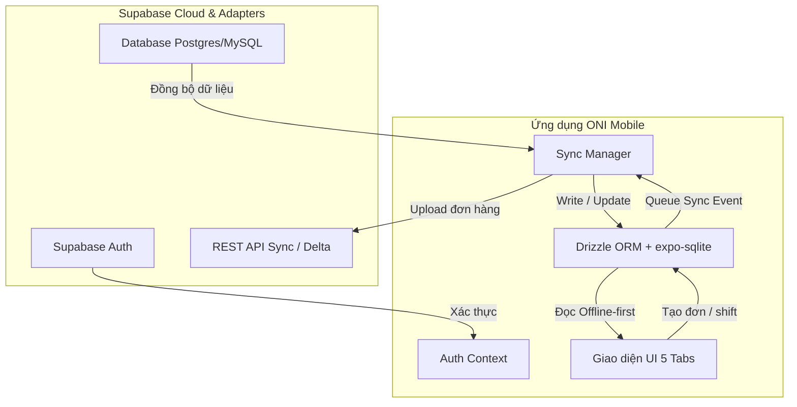

# Kế Hoạch Kết Nối Dữ Liệu Thực Tế Cho ONI Mobile (Offline-First Integration)

Yêu cầu hiện tại là chuyển đổi bộ khung giao diện ONI Mobile từ dạng dữ liệu mẫu (mockups/placeholders) sang kết nối và xử lý **dữ liệu thực tế đầu phiên**. 

Để đảm bảo tốc độ cực nhanh tại quầy và khả năng hoạt động ổn định 100% ngay cả khi mất kết nối mạng, chúng ta sẽ áp dụng mô hình kiến trúc **Offline-First & Event Sourcing** kết hợp giữa cơ sở dữ liệu cục bộ **SQLite (`expo-sqlite`)** được quản lý bằng **Drizzle ORM** và đồng bộ hóa hai chiều với **Supabase Cloud**.

---

## Sơ đồ Kiến trúc Luồng Dữ liệu (Offline-First Data Flow)

---

## Các Điểm Cần Người Dùng Đánh Giá (User Review Required)

> [!IMPORTANT]
> **1. Hỗ trợ chạy offline hoàn toàn khi mất mạng (Offline POS)**
> Khi thu ngân thực hiện thanh toán hóa đơn hoặc đóng/mở ca lúc mất mạng, dữ liệu sẽ được ghi trực tiếp vào SQLite nội địa và đánh dấu trạng thái `sync_status = 'pending'`. Khi phát hiện có mạng trở lại, ứng dụng sẽ có một Background Sync Task tự động đẩy các hóa đơn này lên Cloud.
> 
> **2. Lựa chọn cấu hình Drizzle ORM dùng chung Schema**
> Chúng ta sẽ tái sử dụng trực tiếp các định nghĩa bảng trong `packages/adapters/src/schema.ts` cho cơ sở dữ liệu di động SQLite. Điều này đảm bảo tính nhất quán tuyệt đối về kiểu dữ liệu (TypeScript Types) giữa WebApp và Mobile.

---

## Câu Hỏi Mở Cho Người Dùng (Open Questions)

> [!IMPORTANT]
> **1. Cơ chế đăng nhập offline cho Thu ngân:**
> Khi mất mạng hoàn toàn và ca làm việc chưa được đồng bộ, ứng dụng có nên lưu trữ tạm thông tin đăng nhập được mã hóa (encrypted credentials) của nhân viên trong thiết bị để cho phép đăng nhập offline hay không, hay bắt buộc phải có mạng ở bước Đăng nhập đầu tiên?
> 
> **2. Giới hạn số ngày lưu lịch sử hóa đơn ngoại tuyến:**
> SQLite trên điện thoại nên lưu trữ tối đa bao nhiêu ngày hóa đơn lịch sử (ví dụ: chỉ lưu 30 ngày gần nhất) để tránh làm đầy dung lượng bộ nhớ của thiết bị di động?

---

## Chi Tiết Các Thay Đổi Đề Xuất (Proposed Changes)

### 1. Phân hệ Cơ sở dữ liệu nội địa (Local DB Layer)

#### [NEW] [apps/mobile/lib/db/client.ts](file:///Users/fern/Coding/ERP/oni-saas-starter/apps/mobile/lib/db/client.ts)
- Khởi tạo kết nối SQLite sử dụng thư viện `expo-sqlite`.
- Cấu hình **Drizzle ORM** dùng chung các bảng: `products`, `orders`, `orderItems`, `customers`, `shop_shifts`, `location_resources`, `categories` từ package `@oni/adapters`.
- Chạy các migrations tự động để tạo cấu trúc bảng cục bộ đầu phiên.

### 2. Trình Quản lý Đồng bộ (Sync Manager Service)

#### [NEW] [apps/mobile/lib/sync/SyncManager.ts](file:///Users/fern/Coding/ERP/oni-saas-starter/apps/mobile/lib/sync/SyncManager.ts)
- Hiện thực hóa **Chiến lược đồng bộ 3 cấp độ (3-Tier Sync Strategy)**:
  - **Full Sync (Cấp độ 1):** Xóa sạch SQLite và tải toàn bộ danh mục sản phẩm, khách hàng, sơ đồ phòng bàn từ Cloud qua API về ghi vào thiết bị.
  - **Delta Sync (Cấp độ 2):** Gọi API tải các bản ghi có `updated_at` lớn hơn mốc thời gian sync gần nhất để cập nhật cục bộ.
  - **Upload Sync (Đẩy lên):** Đọc các đơn hàng và ca làm việc có trạng thái `'pending'` trong SQLite để POST lên Server.

### 3. Kết nối dữ liệu vào các màn hình UI (Tab Screens Integration)

#### [MODIFY] [apps/mobile/app/(auth)/login.tsx](file:///Users/fern/Coding/ERP/oni-saas-starter/apps/mobile/app/(auth)/login.tsx)
- Kết nối luồng Đăng nhập với Supabase Authentication thực tế.
- Tải về cấu hình Tenant Domain và lưu trữ token an toàn.

#### [MODIFY] [apps/mobile/app/(auth)/select-branch.tsx](file:///Users/fern/Coding/ERP/oni-saas-starter/apps/mobile/app/(auth)/select-branch.tsx)
- Thay vì nạp danh sách chi nhánh mẫu, gọi truy vấn API lấy danh sách các Chi nhánh (`shops`) hoạt động của Tenant từ Supabase.
- Khi bấm **"Bắt đầu ca làm việc"**, kích hoạt `SyncManager.triggerFullSync()` để tải toàn bộ dữ liệu offline về thiết bị trước khi chuyển vào Dashboard.

#### [MODIFY] [apps/mobile/app/(tabs)/index.tsx](file:///Users/fern/Coding/ERP/oni-saas-starter/apps/mobile/app/(tabs)/index.tsx)
- Thay thế các chỉ số KPI doanh thu mẫu bằng các truy vấn `SUM/COUNT` trực tiếp trên bảng `orders` của SQLite cục bộ.
- Vẽ biểu đồ doanh thu thực tế theo ngày trong ca và thống kê Top sản phẩm bán chạy nhất bằng cách group-by doanh số thực.

#### [MODIFY] [apps/mobile/app/(tabs)/pos.tsx](file:///Users/fern/Coding/ERP/oni-saas-starter/apps/mobile/app/(tabs)/pos.tsx)
- **Bán lẻ:** Đọc danh sách sản phẩm (`products`) trực tiếp từ SQLite theo phân nhóm (`categories`).
- **Phòng bàn:** Đọc trạng thái hoạt động thực tế của phòng bàn từ `location_resources` SQLite.
- **Thanh toán:** Khi nhấn thanh toán, thực hiện insert hóa đơn thực vào SQLite và gọi ngầm lệnh đồng bộ hóa lên Cloud.

#### [MODIFY] [apps/mobile/app/(tabs)/orders.tsx](file:///Users/fern/Coding/ERP/oni-saas-starter/apps/mobile/app/(tabs)/orders.tsx)
- Đọc danh sách hóa đơn lịch sử thực tế từ bảng `orders` của SQLite cục bộ.
- Hiển thị chính xác badge trạng thái đồng bộ (`synced` màu xanh lá, `pending` màu cam).

#### [MODIFY] [apps/mobile/app/(tabs)/customers.tsx](file:///Users/fern/Coding/ERP/oni-saas-starter/apps/mobile/app/(tabs)/customers.tsx)
- Truy vấn danh sách khách hàng thực tế từ SQLite.
- Thao tác nhấn "Thêm khách hàng" sẽ thực hiện `INSERT INTO customers` ngoại tuyến và lập tức trigger đẩy lên Server.

#### [MODIFY] [apps/mobile/app/(tabs)/settings.tsx](file:///Users/fern/Coding/ERP/oni-saas-starter/apps/mobile/app/(tabs)/settings.tsx)
- Kết nối các nút bấm "Đồng bộ toàn phần", "Đồng bộ Delta" với `SyncManager`.
- Hiển thị mốc thời gian thực tế của lần đồng bộ thành công gần nhất.
- Thực hiện lưu trữ thông tin Đóng/Mở ca thực vào SQLite `shop_shifts`.

---

## Kế hoạch Xác minh và Kiểm thử (Verification Plan)

### Kiểm thử ngoại tuyến (Offline POS Scenarios)
1. **Kiểm tra đăng nhập mạng bình thường:** Mở ứng dụng, đăng nhập tài khoản thực tế, chọn chi nhánh chính, xác nhận Full Sync chạy thành công đạt 100% tiến trình.
2. **Kiểm tra ngắt mạng (Airplane Mode):** Bật chế độ máy bay, vào màn hình Bán hàng (POS), thực hiện thanh toán 3 hóa đơn khác nhau (Bán lẻ và Phòng bàn).
   *   *Xác nhận:* Ứng dụng vẫn chạy mượt mà tuyệt đối không có độ trễ, hóa đơn được lưu vào SQLite.
   *   *Xác nhận:* Vào màn hình Hóa đơn thấy 3 hóa đơn này có badge "Chờ đồng bộ" (Pending offline) màu cam.
3. **Kiểm tra kết nối lại mạng:** Tắt chế độ máy bay.
   *   *Xác nhận:* Hệ thống tự động kích hoạt đẩy dữ liệu lên Supabase. Trạng thái hóa đơn tự động chuyển thành "Đã đồng bộ" (Synced) màu xanh lá.
